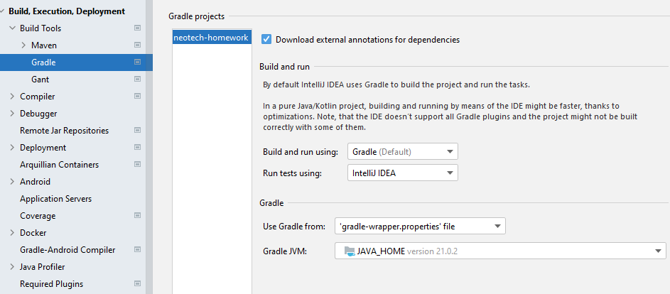

# neotech-homework

[](https://github.com/ximtech/neotech-homework/actions/workflows/build.yml)
[](https://codecov.io/gh/ximtech/neotech-homework)
[](https://app.codacy.com/gh/ximtech/neotech-homework/dashboard?utm_source=gh&utm_medium=referral&utm_content=&utm_campaign=Badge_grade)

### Prerequisites

- `JDK 21` (Optional)
- `Docker`

### Description

Develop an application to determine the country by phone number. Use the "Alphabetical Order" table on the Wikipedia page (https://en.wikipedia.org/wiki/List_of_country_calling_codes#Alphabetical_order) as a source for country codes.

### Functional Requirements

- The user enters a phone number, the application validates it, and determines the country. If the country is successfully determined, the country's name is displayed; otherwise, an error message is shown.
- The application should determine the most appropriate country. For example:
    - For the number `12423222931`, the expected country is `Bahamas`.
    - For the number `11165384765`, the expected countries are `United States, Canada`.
    - For the number `71423423412`, the expected country is `Russia`.
    - For the number `77112227231`, the expected country is `Kazakhstan`.
- The table should be loaded each time the application starts.
- All interactions with the application should be through a RESTful API using JSON as the data format.
- The server should run on port `8088`.


### Non-functional Requirements

#### Backend:

- Java (17+)
- Spring Boot (2+)
- MySQL or PostgreSQL
- Maven or Gradle

#### Frontend:

- HTML
- CSS
- JavaScript

### Notes:

- Provide the ability to build and run the application from the command line.
- Provide the ability to run tests from the command line and generate reports on their execution results.
- The interface design is not crucial; simple and neat layout is sufficient.
- The project should include a `README.md` file with detailed instructions for running the application.
- The project must be publicly accessible on GitHub.

### Constraints

- It is forbidden to use libraries that are direct solutions to the task (e.g., Google Phone Validator), but other libraries are allowed.
- It is forbidden to use methods with full database exports (e.g., repository.findAll()) and similar approaches.

### Timeline

The task must be completed within one week from the date of receipt.

## Run example

### 1. Run application from Docker container

The easiest way to run application is using `docker-compose.yaml` that is located in a root of project<br/>
- Run command: `docker-compose up` or from `IDE` push green arrow:<br/>
  
  
- Wait until containers will up and ready<br/>
  

- Run requests or check `Swagger`

### 2. Build and run application from an IDE

- Check that `JDK 21` for Java has been set up
- Project should build and pull all dependencies automatically. If error happens, make sure that `IDE` configured correctly:<br/>
  

- Project has predefined `.run` configuration and can be used for local development<br/>
  
- Run application. Running in `dev` profile, database will be automatically set up from `compose.yaml` file

- Connect to local database using credential from `compose.yaml` file. Example:<br/>
  

### Swagger

`http://localhost:8088/webjars/swagger-ui/index.html`

### Request examples

- Main web page: `http://localhost:8088/`
- API call. Find country for phone number: 
  Example: `http://localhost:8088/api/phone/number/country/+1116538476` <br/>
  
  
### Run application from command line

- Launch application
```shell script
java -cp build/libs/neotech-homework-1.0.0.jar org.springframework.boot.loader.launch.JarLauncher
```
***Note:*** Command runs only application itself. Database must be running separately, otherwise app will fail
